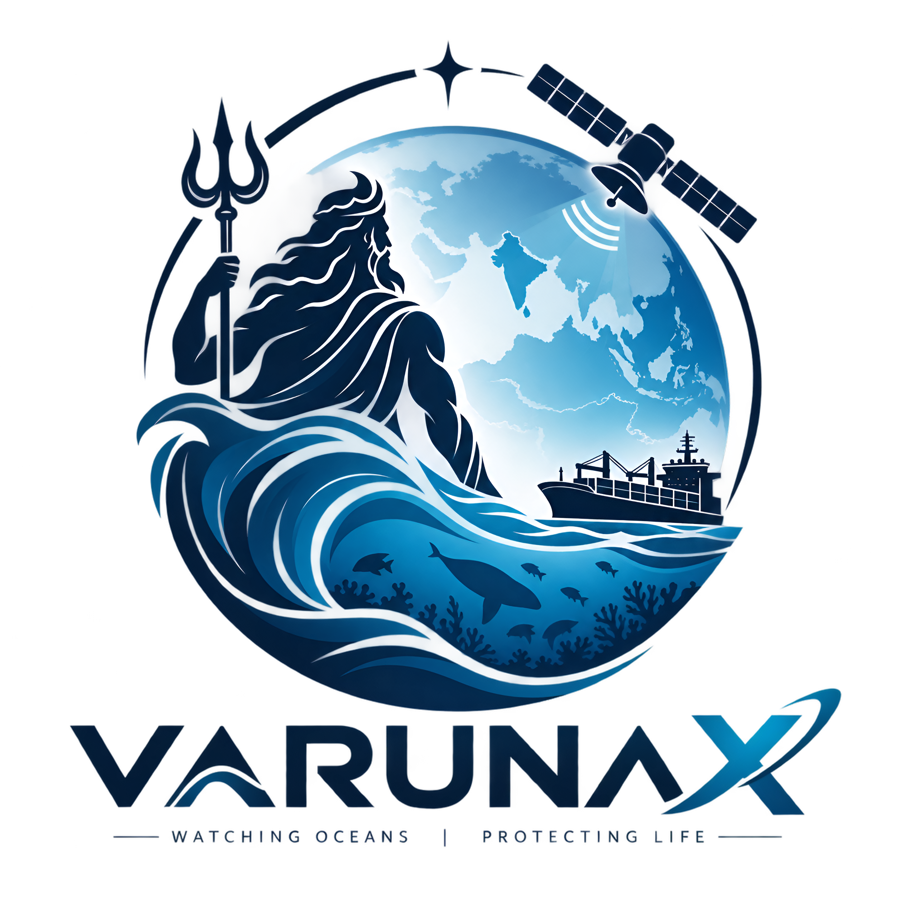
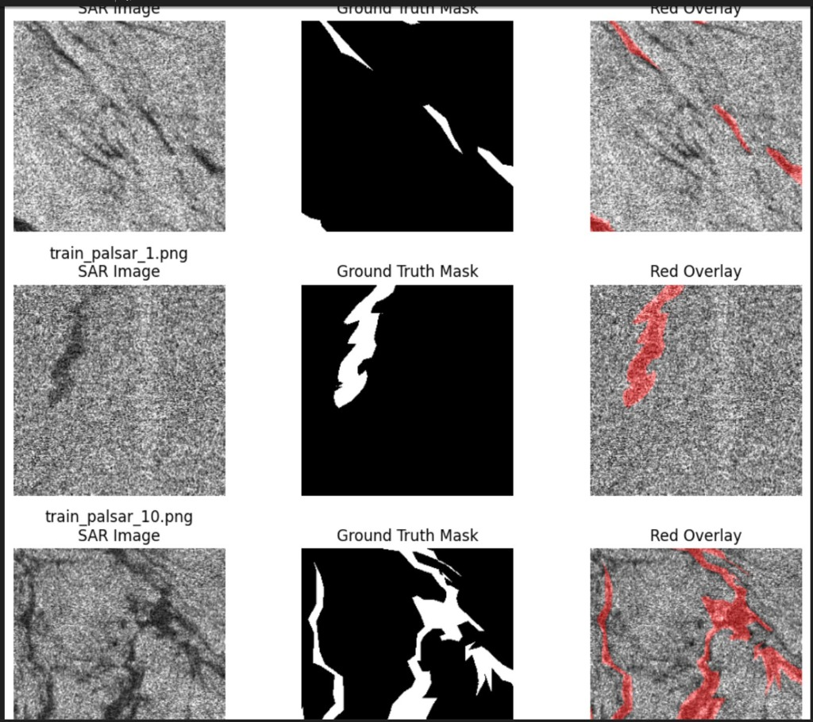
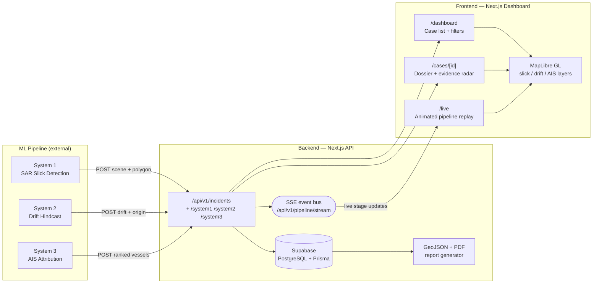
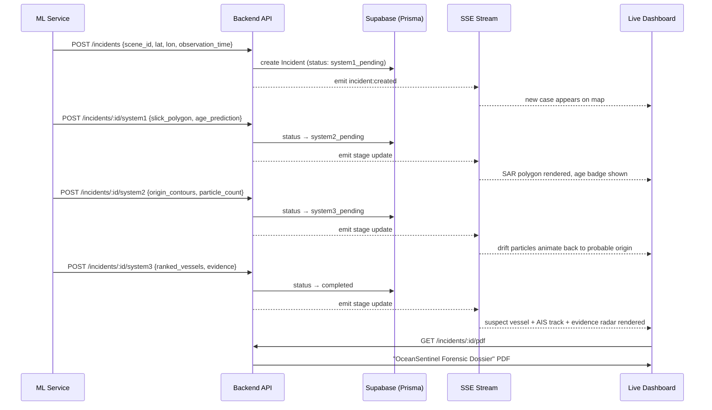
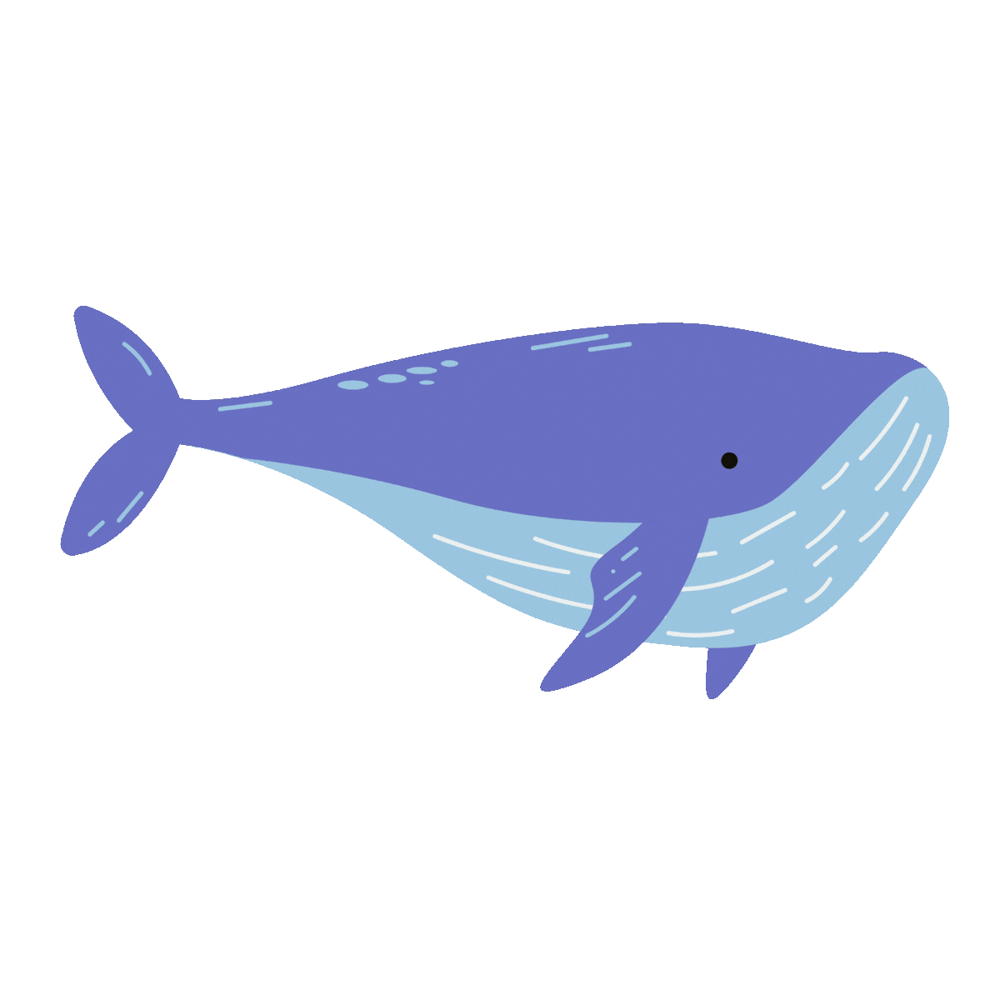
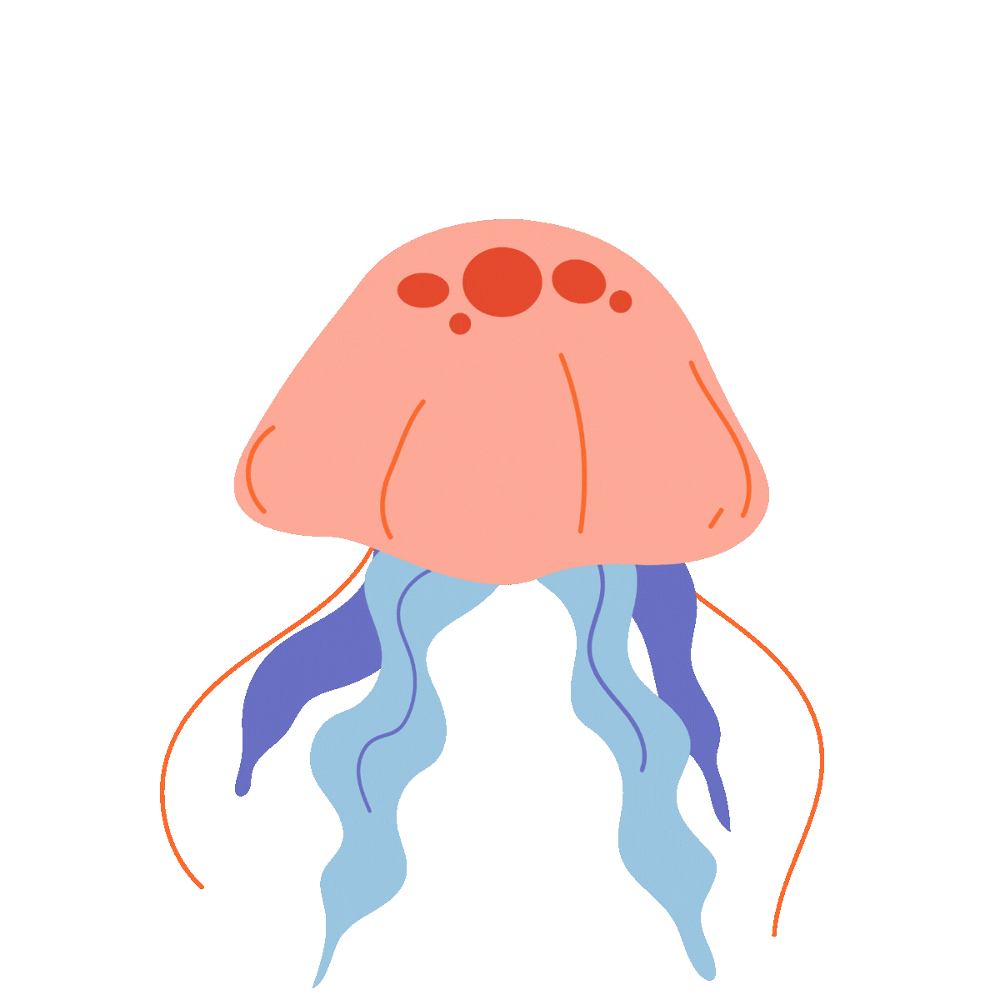
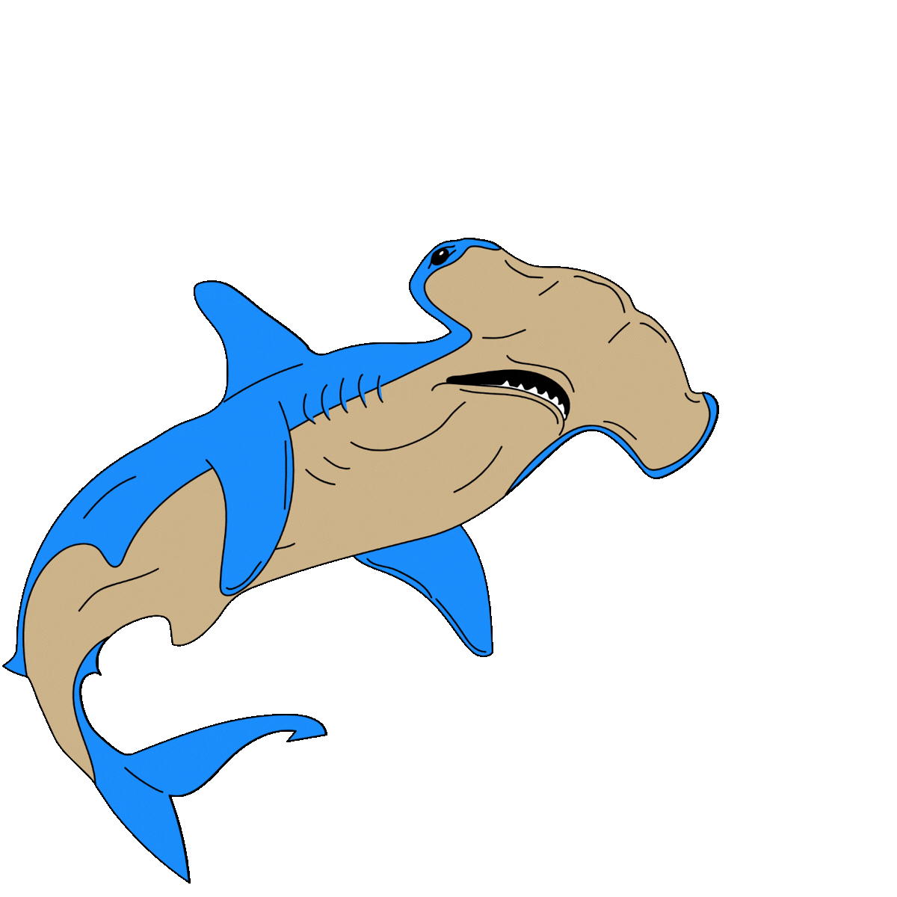
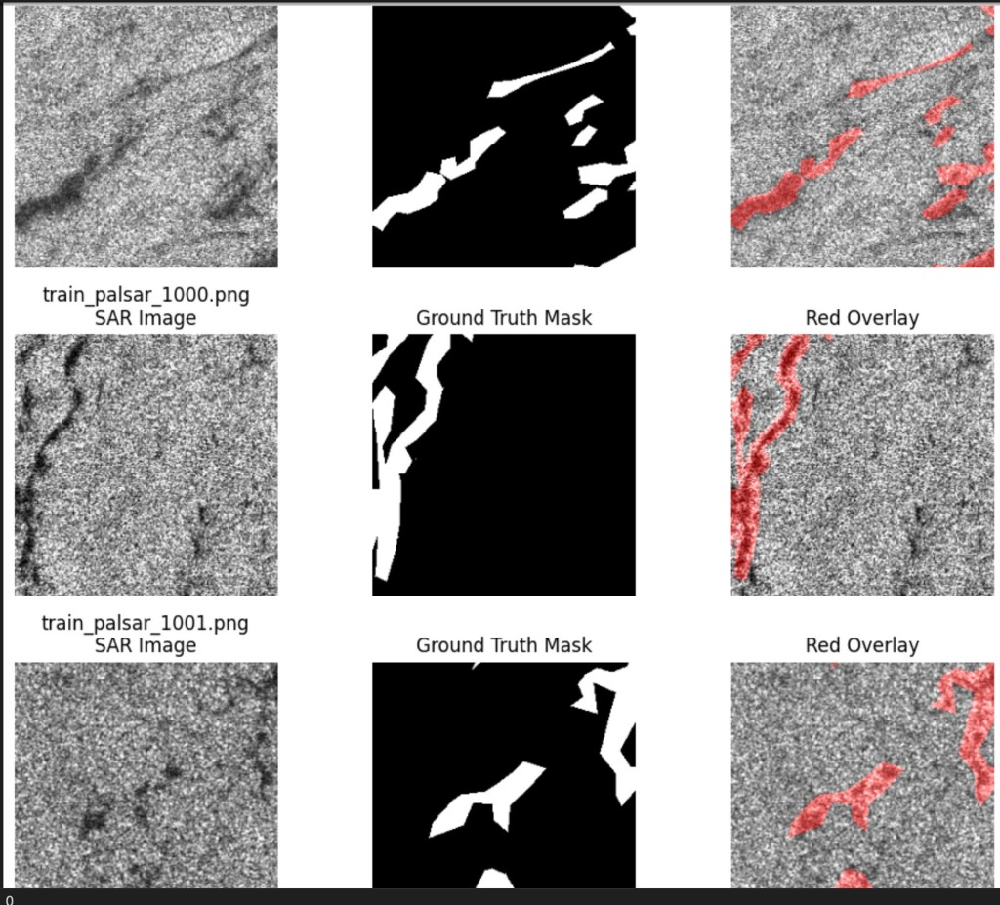
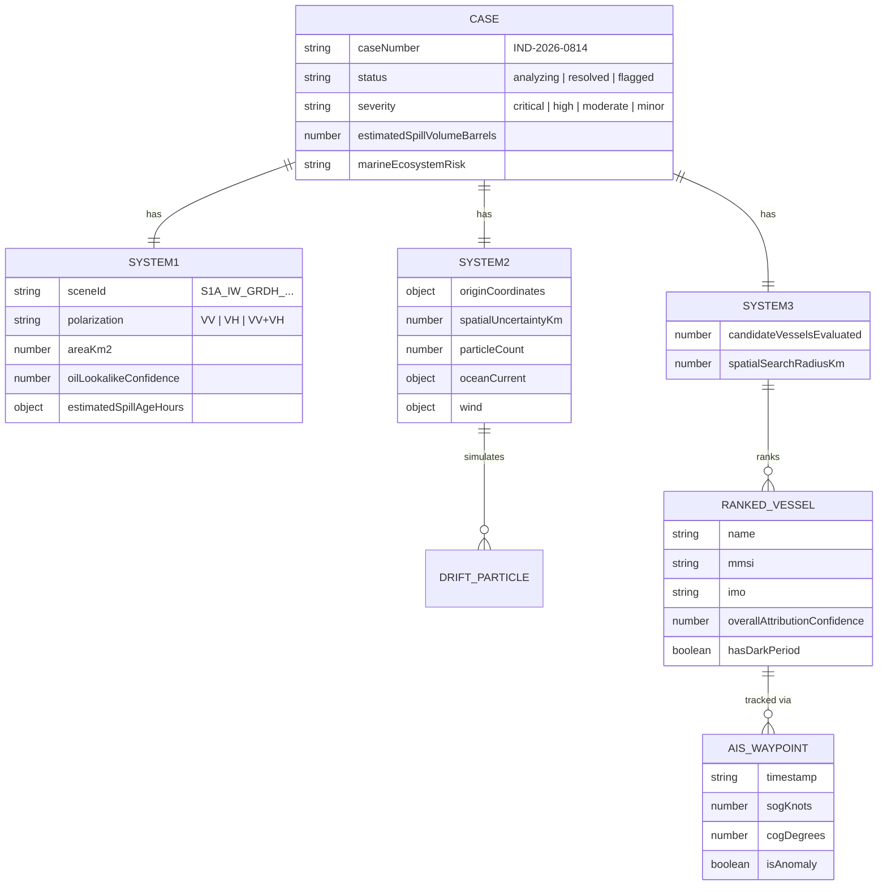

<div align="center">



# VarunaX — The Sea Sentinel

**Autonomous Satellite Oil Spill Detection & AIS Vessel Attribution**

*Built for Smart India Hackathon 2026*




*A PALSAR SAR scene with an oil slick detected and highlighted (red overlay) — this is the raw signal System 1 works from.*

</div>

---

## 🧭 TL;DR for judges

VarunaX turns a raw satellite radar image into a **named vessel and a confidence score** — end to end, with no human in the loop — in three chained ML "systems" fronted by a real API and a live dashboard:

1. **System 1 — Detect**: find an oil slick in a Sentinel-1 SAR scene and estimate how old it is.
2. **System 2 — Hindcast**: run a particle-drift model backwards through ocean current + wind data to estimate *where and when* the spill originated.
3. **System 3 — Attribute**: cross-reference AIS vessel traffic near that origin/time window and rank suspects by evidence (proximity, timing, trajectory match, AIS continuity, vessel type) — flagging AIS "dark periods" as red flags.

The **backend** is a real Next.js API + Supabase/Prisma datastore that any ML pipeline can push results into (a Python client is included), streaming every stage transition to the **frontend** over Server-Sent Events. The frontend is a fully animated, explorable dashboard — not static mockups — with a live map, a step-through pipeline replay, radar-chart evidence visualization, and a generated PDF forensic dossier.

**Start here:** [`/live`](#-live-pipeline-replay) for the animated demo, or jump to [Quick Start](#-quick-start) to run it yourself.

---

## 📖 Table of Contents

- [Why this matters](#-why-this-matters)
- [How it works (architecture)](#-how-it-works-architecture)
- [The 3-system pipeline, in detail](#-the-3-system-pipeline-in-detail)
- [Product tour](#-product-tour)
- [Data model](#-data-model)
- [API reference](#-api-reference)
- [Tech stack](#-tech-stack)
- [Quick start](#-quick-start)
- [Repository structure](#-repository-structure)
- [Known limitations / what's mocked](#-known-limitations--whats-mocked-honesty-section)
- [Roadmap](#-roadmap)

---

## 🌍 Why this matters

| Metric shown in the app | Value |
|---|---|
| Coastline monitored | **1.48M km²** |
| SAR detection precision | **94.2%** |
| Hindcast latency | **< 45 sec** |
| Attribution scoring | **100% explainable** (every score has an evidence breakdown) |

Marine oil spills are usually discovered *after* the polluter is long gone. Attribution today is manual, slow, and often legally indefensible. VarunaX is designed to compress "satellite pass → named suspect vessel" into a single automated, auditable pipeline — producing a court-ready dossier, not just a heatmap.

---

## 🏗 How it works (architecture)



**Real-time flow**: every time an external ML service `POST`s a stage result to the backend, the incident's Postgres row is updated *and* an event fires on an in-process pub/sub bus, which the `/api/v1/pipeline/stream` SSE endpoint forwards straight to any connected dashboard — so the map and telemetry log update live, with zero polling.

---

## 🔬 The 3-system pipeline, in detail



<table>
<tr><th>Stage</th><th>Input</th><th>Output fields</th><th>What it answers</th></tr>
<tr>
<td><b>System 1</b><br/>SAR Detection</td>
<td>Sentinel-1 SAR scene (VV/VH/VV+VH polarization)</td>
<td><code>slickPolygon</code>, <code>areaKm2</code>, <code>elongation</code>, <code>sarTextureEntropy</code>, <code>oilLookalikeConfidence</code>, <code>estimatedSpillAgeHours</code></td>
<td>"Is this actually oil, how big is it, and how old?"</td>
</tr>
<tr>
<td><b>System 2</b><br/>Drift Hindcast</td>
<td>Slick polygon + age window + ocean current / wind fields</td>
<td><code>originCoordinates</code>, <code>originProbabilityEllipse</code>, <code>particleCount</code> (Monte Carlo particles), <code>driftPath</code></td>
<td>"Running time backwards, where and when did this most likely start?"</td>
</tr>
<tr>
<td><b>System 3</b><br/>AIS Attribution</td>
<td>Origin window + AIS vessel traffic in the search radius</td>
<td><code>rankedVessels[]</code> each with <code>evidence</code> (origin proximity, temporal compatibility, trajectory match, AIS continuity, vessel type relevance), <code>hasDarkPeriod</code></td>
<td>"Which vessel(s) were there, and how confident are we?"</td>
</tr>
</table>

---

## 🖥 Product tour

### Landing page — `/`
Full-bleed autoplay hero video, a typewriter-animated tagline, an interactive stage-pill demo (`#interactive-demo`) that drives a live MapLibre map through all 4 pipeline states without needing the backend running, and an ecological-impact section.

### Dashboard — `/dashboard`
 

Fleet-wide case list with live search/filter (status, severity, region, vessel name, IMO), aggregate metrics (total slick area, active investigations, resolved count), and an overview map plotting every case as a severity-colored polygon.

### Case dossier — `/cases/[id]`
Per-incident deep dive: severity/status banner, spill volume, an **`AttributionRadar`** spider chart of the 5 evidence scores, a full **AIS track table**, and a one-click **"Generate Coast Guard Dossier"** PDF export.

### Live pipeline replay — `/live` 🎬
The flagship demo. Auto-advances System 1 → 2 → 3 → Completed with Play/Pause/Step/1×–4× speed controls, a live auto-scrolling terminal-style telemetry log (`[SAR-INGEST]`, `[DRIFT-HINDCAST]`, `[AIS-ATTRIBUTION]`, `[PIPELINE-COMPLETE]`), and a canvas confetti burst on completion — all synced to the map.

  

<details>
<summary><b>📸 More sample SAR scenes used by the demo</b></summary>

| Grayscale SAR | Detected slick (red overlay) |
|---|---|
|  |  |

Additional per-scene `mask.png` / `overlay.png` / `sar.png` triads live under `frontend/public/slicks/palsar_*/`.
</details>

---

## 🗄 Data model



The **backend** (Prisma) persists the same shape more loosely — one `Incident` row per case with `observation`, `system1`, `system2`, `system3` as flexible `JSONB` columns, so schema evolution on the ML side never needs a migration:

```prisma
model Incident {
  id        String         @id            // INCIDENT_YYYY_NNN
  status    IncidentStatus @default(system1_pending)
  observation Json?        @db.JsonB
  system1     Json?        @db.JsonB      // detection
  system2     Json?        @db.JsonB      // drift
  system3     Json?        @db.JsonB      // attribution
}
enum IncidentStatus {
  system1_pending
  system2_pending
  system3_pending
  completed
  unresolved
}
```

The **frontend** ships 5 richly hand-authored mock cases (Mumbai High, Strait of Malacca, North Sea Brent, Strait of Hormuz, Gulf of Mexico) — each with full SAR polygons, Monte Carlo drift particles, and AIS tracks with anomaly flags — so the entire UI is demoable with zero backend/database setup.

---

## 🔌 API reference

Base path: `backend/src/app/api`

| Method | Route | Auth | Description |
|---|---|---|---|
| `GET` | `/api/health` | — | DB connectivity check |
| `GET` | `/` | — | API metadata / endpoint index |
| `GET` | `/api/v1/incidents` | — | Paginated, filterable case list + aggregate metrics |
| `POST` | `/api/v1/incidents` | `X-API-Key` | Create a new incident (System 1 kickoff) |
| `GET` | `/api/v1/incidents/:id` | — | Full incident record |
| `POST` | `/api/v1/incidents/:id/system1` | `X-API-Key` | Push SAR detection results |
| `POST` | `/api/v1/incidents/:id/system2` | `X-API-Key` | Push drift hindcast results |
| `POST` | `/api/v1/incidents/:id/system3` | `X-API-Key` | Push AIS attribution results |
| `GET` | `/api/v1/incidents/:id/results` | — | Full dossier (all 3 systems merged) |
| `GET` | `/api/v1/incidents/:id/geojson` | — | Downloadable GeoJSON (observation + slick + origin contours) |
| `GET` | `/api/v1/incidents/:id/pdf` | — | Downloadable **"OceanSentinel Forensic Dossier"** PDF |
| `GET` | `/api/v1/pipeline/stream?incidentId=` | — | Server-Sent Events — live stage updates |

All internal write endpoints are validated with **Zod** schemas (`CreateIncidentSchema`, `System1OutputSchema`, `System2OutputSchema`, `System3OutputSchema`) and gated by an `X-API-Key` header checked against `INTERNAL_API_KEY`.

A ready-made **Python client** (`backend/python-client/oilspill_api_client.py`) lets any ML service integrate in ~4 lines:

```python
from oilspill_api_client import OilSpillAPIClient

client = OilSpillAPIClient(base_url="http://localhost:3000/api/v1", api_key="dev-secret-key-change-me")
incident_id = client.start_incident(observation_time=..., scene_id="S1A_...", lat=10.0, lon=70.0)
client.submit_system1_results(incident_id, {...})
client.submit_system2_results(incident_id, {...})
client.submit_system3_results(incident_id, {...})
```

Or simulate the whole pipeline without any ML models at all:

```bash
cd backend && npm run simulate   # POSTs mock System 1 → 2 → 3 payloads with realistic delays
```

---

## 🧰 Tech stack

| Layer | Technology |
|---|---|
| Frontend framework | Next.js 16 (App Router), React 19 |
| Frontend styling/motion | Tailwind CSS 4, Framer Motion, `clsx` / `tailwind-merge` |
| Mapping | MapLibre GL JS — custom slick/drift/AIS layers, radar evidence chart |
| Backend framework | Next.js 14 (API routes only) |
| Database / ORM | Supabase PostgreSQL + Prisma 6 (`JSONB` flexible schema) |
| Validation | Zod |
| Real-time | Server-Sent Events (in-process pub/sub event bus) |
| Reporting | GeoJSON export, `@react-pdf/renderer` PDF forensic dossier |
| External ML integration | Python REST client (`requests`) |
| Deployment target | Vercel (both apps) |

---

## 🚀 Quick start

### 1. Backend (API + database)

```bash
cd backend
npm install
cp .env.example .env        # fill in Supabase DATABASE_URL / DIRECT_URL / INTERNAL_API_KEY
npx prisma migrate dev --name init
npx prisma db seed
npm run dev                 # http://localhost:3000
```

Try the pipeline instantly, no ML models required:

```bash
npm run simulate
```

### 2. Frontend (dashboard)

```bash
cd frontend
npm install
npm run dev                 # runs entirely on mock data — no backend needed for the tour
```

Open `http://localhost:3000` → click **Launch Live** or go straight to `/live` for the animated pipeline replay.

Full setup, environment variables, and Vercel deployment steps: [`backend/README.md`](backend/README.md) · [`frontend/README.md`](frontend/README.md)

---

## 📁 Repository structure

```
VarunaX/
├── backend/                          # Next.js API — the "system of record"
│   ├── prisma/schema.prisma          # Incident model (JSONB per-system payloads)
│   ├── scripts/simulate-pipeline.ts  # end-to-end mock pipeline runner
│   ├── python-client/                # drop-in client for external ML services
│   └── src/app/api/v1/incidents/     # System 1/2/3 ingestion + query + export routes
│
└── frontend/                         # Next.js dashboard — the "cockpit"
    ├── src/app/page.tsx              # landing + interactive demo
    ├── src/app/dashboard/            # fleet-wide case list
    ├── src/app/cases/[id]/           # per-case dossier + evidence radar
    ├── src/app/live/                 # animated pipeline replay (flagship demo)
    ├── src/types/maritime.ts         # CaseRecord / System1 / System2 / System3 types
    └── src/data/mockCases.ts         # 5 fully-authored demo incidents
```

---

## ⚠️ Known limitations / what's mocked (honesty section)

We'd rather a judge hear this from us than discover it:

- The backend's `POST /system1`, `/system2`, `/system3` routes currently **write a hardcoded mock payload** (`MOCK_INCIDENTS[0]`) regardless of the request body — this is a stand-in for real ML model output during the hackathon build. The API contract, validation schemas, and Python client are fully real and ready for real model integration; only the handler bodies need swapping.
- The frontend's landing/dashboard/case/live views run **entirely on hand-authored mock case data** (`mockCases.ts`) so the product can be demoed with zero infrastructure — wiring them to the live backend API is the next integration step.
- No CI pipeline or automated test suite yet (hackathon time constraints).

We're flagging these explicitly because the pipeline **contract, schema, and UI are production-shaped** — the ML model outputs are the piece that plugs in last.

---

## 🗺 Roadmap

- [ ] Wire real SAR detection / drift / AIS models into `system1`/`system2`/`system3` endpoints
- [ ] Connect frontend to live backend API (replace mock data with `fetch`/SSE)
- [ ] Auth for the dashboard (currently open)
- [ ] Automated evaluation harness for attribution accuracy
- [ ] Multi-tenant / multi-agency access control for the PDF dossier

---

<div align="center">

*VarunaX — from satellite pixel to named suspect, automatically.*

</div>
